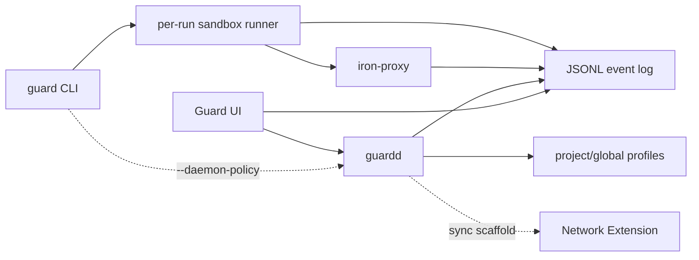

# guardd

`guardd` is Guard's experimental local policy daemon. It is separate from the
default per-run CLI path: `guard`, `guard --ask-network`, and
`guard --deep-egress --ask-network` keep working without a daemon.

## Benefit

The per-run CLI is intentionally simple and daemon-free. `guardd` exists for the
richer app-style workflow: persistent policy state, event history, native
alerts, TLS artifact management, rule editing, UI health checks, and future
Network Extension synchronization.

Use `guardd` when you want a long-running local API for Guard.app or another
trusted local client. Do not make project scripts depend on it unless the
workflow explicitly opts into daemon-backed decisions.

## Current Status

`guardd` is a prototype. It does not yet own production launchd packaging,
signed installation, a privileged helper, or Network Extension lifecycle. The
native monitor can start a temporary foreground `guardd`, but that is still
development scaffolding.

## How It Fits



The important boundary: `guardd` is additive. The CLI may delegate richer
policy decisions to it when requested, but the simple per-run path must retain
local fallback behavior.

## Start It

```sh
node daemon/guardd.mjs \
  --event-log "$HOME/Library/Application Support/guard/events.jsonl" \
  --api-token "$(openssl rand -base64 32)"
```

Useful environment settings:

```sh
GUARD_EVENT_LOG=~/Library/Application\ Support/guard/events.jsonl
GUARD_STATE_DIR=~/Library/Application\ Support/guard
GUARDD_HOST=127.0.0.1
GUARDD_PORT=8765
GUARDD_POLICY_ROOT=~/code/my-project
GUARDD_REPO_ROOT=/Users/otr/code/guard
GUARDD_API_TOKEN=...
GUARDD_TOKEN_KEYCHAIN=1
```

When listening outside loopback, `guardd` requires an API token. Write endpoints
require a token even on loopback.

## CLI Interaction

Normal guarded runs do not require the daemon:

```sh
guard pnpm install
guard --ask-network pnpm run dev
```

Daemon-backed ask mode is explicit:

```sh
guard --daemon-policy pnpm run dev
```

In that mode, unknown proxy decisions are enqueued as pending alerts in
`guardd`. Guard.app or another daemon client can resolve the alert. If the
daemon is unreachable or the alert times out, the request is denied.

Shim bypasses can also be sent to the daemon for approval when it is available:

```sh
GUARD_BYPASS_REQUIRE_APPROVAL=1 PNPM_GUARD_BYPASS=1 pnpm install
```

## UI Interaction

The native UI uses `guardd` for:

- health and runtime state.
- event queries and durable event index summaries.
- pending alert queues.
- profile and template listing.
- rule edits with optimistic version checks.
- TLS CA and host-certificate artifact management.
- security diagnostics.
- Network Extension sync scaffold state.

The UI can also read the JSONL event log directly for local monitor views, but
`guardd` is the intended API boundary for stateful operations.

## Main APIs

Read-only endpoints include:

- `GET /health`
- `GET /state`
- `GET /events`
- `GET /events/query`
- `GET /events/index`
- `GET /alerts`
- `GET /alerts/pending`
- `GET /policy?profile=guard`
- `GET /profiles`
- `GET /templates`
- `GET /tls/status`
- `GET /security/status`
- `GET /accounts`
- `GET /accounts/:id`
- `GET /accounts/:id/login-preview`

Authenticated write endpoints include:

- `POST /policy/evaluate`
- `POST /alerts/pending`
- `POST /alerts/:id/resolve`
- `POST /profiles/:name/rules`
- `POST /profiles/:name/tls`
- `POST /tls/ca`
- `POST /tls/cert`
- `POST /extension/sync`
- `POST /events/truncate`
- `POST /auth/token/rotate`
- `POST /auth/token/persist`
- `POST /accounts/refresh`
- `POST /accounts/:id/refresh`

See [daemon/README.md](../daemon/README.md) for the detailed endpoint list.

## State and Events

`guardd` tails Guard's JSONL event log and keeps a bounded recent-event buffer.
It also maintains durable metadata under `GUARD_STATE_DIR`, including event
cursor recovery state, retention metadata, and a rebuilt event index.

Events are still produced by the per-run runner, sandbox denial stream,
`iron-proxy`, and daemon mutations. `guardd` does not replace the event schema;
it aggregates and indexes the same stream.

## Policy Writes

`guardd` can mutate writable project profiles through rule endpoints. If only a
built-in profile exists, it materializes a writable copy under the configured
policy root before editing.

Writes support optimistic concurrency through `If-Match`, `version`, or
`profileVersion`. Use the version returned by `GET /profiles/:name` or
`GET /policy?profile=name` to avoid overwriting another editor's change.

## Security Model

Current protections:

- loopback listener by default.
- API token required for writes.
- token metadata endpoints never return the configured secret.
- optional macOS Keychain storage for daemon API tokens.
- security diagnostics for token status, state directory permissions, event log
  write exposure, and TLS key file permissions.

Current limitations:

- no production launch agent yet.
- no privileged helper boundary yet.
- no signed/notarized installer yet.
- no production Network Extension activation or recovery lifecycle yet.
- no replacement for the daemon-free CLI fallback path.

## Shared architecture requirements

## Two-Mode Goal

Keep Guard cleanly split into two supported operating modes:

- Simple per-run mode: `guard`, `guard --ask-network`, and
  `guard --deep-egress --ask-network` must remain daemon-free, easy to reason
  about, and suitable for development commands, one-off shells, CI-like local
  runs, and quick repo exploration. This mode starts any needed local proxy for
  the current run only, stores temporary state under the run directory, and
  should keep working even when no Guard daemon, native UI, launch agent, or
  Network Extension is installed.
- Daemon/UI mode: `guardd`, Guard.app, native alerts, monitor windows, rule
  editors, persistent policy databases, and Network Extension integrations can
  provide the richer Little Snitch-style experience. This mode may manage
  shared policy state, persistent rules, event history, long-running proxy
  instances, and native notifications.

Do not make the simple per-run path depend on daemon/UI availability. The daemon
and UI should be additive: when available, the CLI may delegate richer policy
decisions to them; when unavailable, the CLI should retain the current local
fallback behavior.

Shared code should live behind clear boundaries so both modes use the same rule
language and policy semantics where practical:

- profile loading and template imports
- host/domain, method, path, and wildcard rule matching
- raw TCP destination rule normalization and launch-time host resolution
- iron-proxy config generation
- proxy environment generation for HTTP, SOCKS, SSH, Git, package managers,
  and helper scripts
- network decision/event schemas
- prompt decision protocol and result shapes
- audit/discovery summaries

Mode-specific code should stay separate:

- per-run prompt service and temporary decision cache
- daemon lifecycle and persistent rule store
- native menu bar app, alerts, rule editor, and monitor UI
- Network Extension/System Extension setup and adapters

## Target Architecture

The long-term design target is a unified macOS security app that combines
Guard's process/filesystem policy model with iron-proxy's deep HTTP policy and
Apple's modern Network Extension model. Prefer a System Extension plus
`NetworkExtension.framework` over any kernel extension approach.

Core components:

- `Guard.app`: native macOS UI with a menu bar monitor, live activity view,
  rules editor, profile/template editor, settings, and allow/deny/ask alerts.
- `guardd`: local policy daemon that owns persistent policy state, launches
  guarded runs, starts per-profile proxy instances, aggregates events, and
  exposes a local API to the UI and CLI.
- `guard` CLI: developer entrypoint that keeps current workflows working and
  delegates to `guardd` when available.
- `iron-proxy`: deep HTTP/HTTPS policy backend for domain, method, path,
  header, and request-level decisions when traffic is routed through the local
  proxy.
- Network Extension: app/process/destination-level visibility and coarse
  allow/deny enforcement for direct egress, bypass detection, and traffic that
  does not cooperate with proxy environment variables.
- sandbox layer: per-run filesystem containment, fake home/temp directories,
  read/write rules, and project/app profile enforcement.
